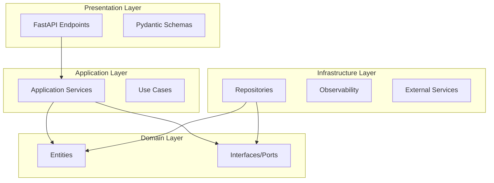

# Архитектура проекта

## Обзор

Проект построен на принципах **Clean Architecture**, где код организован в концентрические слои с четким направлением зависимостей — от внешних слоёв к внутренним.



## Слои (Layers)

### 1. Domain Layer (`src/app/domain`)

**Ядро бизнес-логики**. Не имеет внешних зависимостей (кроме стандартной библиотеки).

| Директория | Назначение |
|------------|------------|
| `entities/` | Бизнес-сущности (dataclasses, Pydantic models) |
| `interfaces/` | Интерфейсы (Protocol, ABC) для репозиториев и сервисов |

**Пример сущности:**
```python
from dataclasses import dataclass

@dataclass
class Document:
    text: str
    score: float = 0.0
```

**Пример интерфейса:**
```python
from typing import Protocol

class ISearchRepository(Protocol):
    async def search(self, query: str) -> list[Document]: ...
```

### 2. Application Layer (`src/app/application`)

**Сценарии использования (Use Cases)**. Оркестрирует бизнес-логику, вызывая методы доменных сущностей и репозиториев.

| Директория | Назначение |
|------------|------------|
| `services/` | Application Services, реализующие бизнес-сценарии |

**Пример сервиса:**
```python
class SearchService:
    def __init__(self, repository: ISearchRepository) -> None:
        self._repository = repository

    @monitor(event_name=Events.SEARCH_SERVICE)
    async def search(self, query: str) -> list[Document]:
        return await self._repository.search(query=query)
```

**Зависит от:** Domain

### 3. Infrastructure Layer (`src/app/infrastructure`)

**Реализация интерфейсов**. Работа с внешним миром: базы данных, API, файловая система.

| Директория | Назначение |
|------------|------------|
| `persistence/` | Реализации репозиториев, ORM модели |
| `observability/` | Логирование, трейсинг, метрики |
| `services/` | Клиенты внешних API |

**Пример репозитория:**
```python
class SearchRepository:
    async def search(self, query: str) -> list[Document]:
        # Реальная реализация с OpenSearch
        results = await self._client.search(query)
        return [Document(text=r["text"]) for r in results]
```

**Зависит от:** Domain, Application

### 4. Presentation Layer (`src/app/presentation`)

**Точка входа**. HTTP API, CLI, gRPC — любой способ взаимодействия с приложением.

| Директория | Назначение |
|------------|------------|
| `api/v1/endpoints/` | FastAPI route handlers |
| `api/schemas/` | Pydantic модели для запросов/ответов (DTOs) |
| `api/common/` | Общие компоненты (healthcheck, metrics) |

**Пример endpoint:**
```python
@router.get("/search")
async def search(
    query: str,
    service: SearchService = Depends(get_search_service),
) -> SearchResponse:
    results = await service.search(query=query)
    return SearchResponse(results=results)
```

**Зависит от:** Application

### 5. Core Layer (`src/app/core`)

**Shared Kernel**. Общие компоненты, используемые всеми слоями.

| Файл | Назначение |
|------|------------|
| `containers.py` | DI-контейнеры (dependency-injector) |
| `exceptions.py` | Кастомные исключения |
| `constants.py` | Глобальные константы |
| `events.py` | Определения событий для мониторинга |
| `app_factory.py` | Фабрика FastAPI приложения |

### 6. Utils Layer (`src/app/utils`)

**Утилиты**. Вспомогательный код без бизнес-логики.

| Файл | Назначение |
|------|------------|
| `configs.py` | Загрузка конфигурации, Pydantic config models |
| `serializer.py` | Сериализация объектов, ORJSONResponse |
| `monitor.py` | Декоратор мониторинга |

## Поток данных

```
HTTP Request
     │
     ▼
┌─────────────┐
│ Presentation │ ← Валидация (Pydantic)
│   (FastAPI)  │
└─────┬───────┘
      │
      ▼
┌─────────────┐
│ Application  │ ← Бизнес-логика
│  (Services)  │
└─────┬───────┘
      │
      ▼
┌─────────────┐
│    Domain    │ ← Entities, Interfaces
│  (Entities)  │
└─────┬───────┘
      │
      ▼
┌─────────────┐
│Infrastructure│ ← База данных, внешние API
│(Repositories)│
└─────────────┘
```

## Dependency Injection

Проект использует `dependency-injector` для управления зависимостями:

```python
# src/app/core/containers.py
class InfrastructureContainer(containers.DeclarativeContainer):
    config = providers.Configuration()
    
    search_repository = providers.Singleton(SearchRepository)
    
    search_service = providers.Singleton(
        SearchService,
        repository=search_repository,
    )
```

**Преимущества:**
- Централизованная конфигурация зависимостей
- Легкая подмена зависимостей в тестах
- Отложенная инициализация (lazy loading)
- Type-safe injection

## Следующие шаги

- [Структура проекта](structure.md) — детальная организация файлов
- [Тестирование](testing.md) — как тестировать каждый слой
