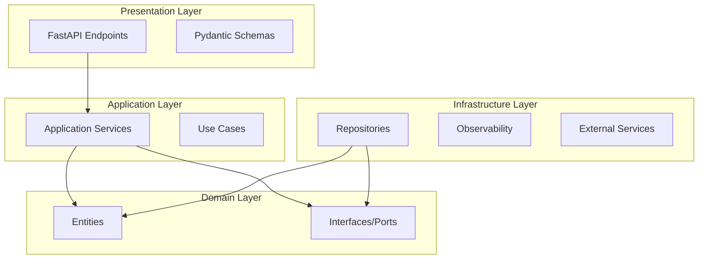

# Архитектура проекта

## Обзор

Проект построен на принципах **Clean Architecture**, где код организован в концентрические слои с четким направлением зависимостей — от внешних слоёв к внутренним.

## Неприкосновенные правила качества (в т.ч. для агентов)

- **Запрещено подавлять проверки в коде**: `# noqa`, `# type: ignore` и аналоги недопустимы.
- **Запрещено самовольно добавлять игноры в `pyproject.toml`** (например `extend-per-file-ignores`, `ignore` и т.п.).
- **Любая проблема должна решаться**, а не скрываться подавлением линтера/типов.


```mermaid
graph TB
    subgraph Presentation["Presentation Layer"]
        API[FastAPI Endpoints]
        Schemas[Pydantic Schemas]
    end
    
    subgraph Application["Application Layer"]
        Services[Application Services]
        UseCases[Use Cases]
    end
    
    subgraph Domain["Domain Layer"]
        Entities[Entities]
        Interfaces[Interfaces/Ports]
    end
    
    subgraph Infrastructure["Infrastructure Layer"]
        Repos[Repositories]
        Observability[Observability]
        External[External Services]
    end
    
    API --> Services
    Services --> Entities
    Services --> Interfaces
    Repos --> Interfaces
    Repos --> Entities
```

## Слои (Layers)

### 1. Domain Layer (`src/app/domain`)

**Ядро бизнес-логики**. Не имеет внешних зависимостей (кроме стандартной библиотеки).

| Директория | Назначение |
|------------|------------|
| `entities/` | Бизнес-сущности (dataclasses, Pydantic models) |
| `interfaces/` | Интерфейсы (Protocol, ABC) для репозиториев и сервисов |

**Пример сущности:**
```python
from dataclasses import dataclass

@dataclass
class Document:
    text: str
    score: float = 0.0
```

**Пример интерфейса:**
```python
from typing import Protocol

class ISearchRepository(Protocol):
    async def search(self, query: str) -> list[Document]: ...
```

### 2. Application Layer (`src/app/application`)

**Сценарии использования (Use Cases)**. Оркестрирует бизнес-логику, вызывая методы доменных сущностей и репозиториев.

| Директория | Назначение |
|------------|------------|
| `services/` | Application Services, реализующие бизнес-сценарии |

**Пример сервиса:**
```python
class SearchService:
    def __init__(self, repository: ISearchRepository) -> None:
        self._repository = repository

    @monitor(event_name=Events.SEARCH_SERVICE)
    async def search(self, query: str) -> list[Document]:
        return await self._repository.search(query=query)
```

**Зависит от:** Domain

### 3. Infrastructure Layer (`src/app/infrastructure`)

**Реализация интерфейсов**. Работа с внешним миром: базы данных, API, файловая система.

| Директория | Назначение |
|------------|------------|
| `persistence/` | Реализации репозиториев, ORM модели |
| `observability/` | Логирование, трейсинг, метрики |
| `services/` | Клиенты внешних API |

**Пример репозитория:**
```python
class SearchRepository:
    async def search(self, query: str) -> list[Document]:
        # Реальная реализация с OpenSearch
        results = await self._client.search(query)
        return [Document(text=r["text"]) for r in results]
```

**Зависит от:** Domain, Application

### 4. Presentation Layer (`src/app/presentation`)

**Точка входа**. HTTP API, CLI, gRPC — любой способ взаимодействия с приложением.

| Директория | Назначение |
|------------|------------|
| `api/v1/endpoints/` | FastAPI route handlers |
| `api/schemas/` | Pydantic модели для запросов/ответов (DTOs) |
| `api/common/` | Общие компоненты (healthcheck, metrics) |

**Пример endpoint:**
```python
@router.get("/search")
async def search(
    query: str,
    service: SearchService = Depends(get_search_service),
) -> SearchResponse:
    results = await service.search(query=query)
    return SearchResponse(results=results)
```

**Зависит от:** Application

### 5. Core Layer (`src/app/core`)

**Shared Kernel**. Общие компоненты, используемые всеми слоями.

| Файл | Назначение |
|------|------------|
| `containers.py` | DI-контейнеры (dependency-injector) |
| `exceptions.py` | Кастомные исключения |
| `constants.py` | Глобальные константы |
| `events.py` | Определения событий для мониторинга |
| `app_factory.py` | Фабрика FastAPI приложения |

### 6. Utils Layer (`src/app/utils`)

**Утилиты**. Вспомогательный код без бизнес-логики.

| Файл | Назначение |
|------|------------|
| `configs.py` | Загрузка конфигурации, Pydantic config models |
| `serializer.py` | Сериализация объектов, ORJSONResponse |
| `monitor.py` | Декоратор мониторинга |

## Поток данных

```
HTTP Request
     │
     ▼
┌─────────────┐
│ Presentation │ ← Валидация (Pydantic)
│   (FastAPI)  │
└─────┬───────┘
      │
      ▼
┌─────────────┐
│ Application  │ ← Бизнес-логика
│  (Services)  │
└─────┬───────┘
      │
      ▼
┌─────────────┐
│    Domain    │ ← Entities, Interfaces
│  (Entities)  │
└─────┬───────┘
      │
      ▼
┌─────────────┐
│Infrastructure│ ← База данных, внешние API
│(Repositories)│
└─────────────┘
```

## Dependency Injection

Проект использует `dependency-injector` для управления зависимостями:

```python
# src/app/core/containers.py
class InfrastructureContainer(containers.DeclarativeContainer):
    config = providers.Configuration()
    
    search_repository = providers.Singleton(SearchRepository)
    
    search_service = providers.Singleton(
        SearchService,
        repository=search_repository,
    )
```

**Преимущества:**
- Централизованная конфигурация зависимостей
- Легкая подмена зависимостей в тестах
- Отложенная инициализация (lazy loading)
- Type-safe injection

## Добавление нового use case (шаблон)

Новый сценарий использования добавляется по одному и тому же шаблону: **Domain (интерфейс + сущности) → Application (сервис) → Infrastructure (репозиторий) → Presentation (schemas + endpoint)**. Плагинной модели или явных extension points для сторонних интеграций в проекте нет — всё расширение идёт через добавление кода в эти слои.

**Референс:** существующий use case «поиск» — `ISearchRepository` / `SearchRepository`, `SearchService`, `POST /api/v1/.../answer/generate`.

### 1. Domain

- **Интерфейс репозитория** в `src/app/domain/interfaces/` — `Protocol` с нужными методами (например `IXxxRepository`).
- **Сущности** в `src/app/domain/entities/` — dataclass’ы для доменных объектов, если их ещё нет.

### 2. Application

- **Сервис** в `src/app/application/services/xxx_service.py` — класс принимает репозиторий по интерфейсу, реализует use case (при необходимости с `@monitor` и `Events`).

### 3. Infrastructure

- **Репозиторий** в `src/app/infrastructure/persistence/repositories/xxx_repository.py` — класс, реализующий интерфейс из Domain (работа с БД/API и т.д.).

### 4. Core (DI)

- В `src/app/core/containers.py` в `AppContainer`:
  - провайдер репозитория: `xxx_repository = providers.Singleton(XxxRepository)`;
  - провайдер сервиса: `xxx_service = providers.Singleton(XxxService, repository=xxx_repository)`.

### 5. Presentation

- **Schemas** в `src/app/presentation/api/schemas/xxx.py` — Pydantic-модели запроса/ответа для API.
- **Endpoint** в `src/app/presentation/api/v1/endpoints/xxx.py` — роутер с `Depends(Provide[AppContainer.xxx_service])`, вызов сервиса, маппинг сущностей в schemas.
- В `src/app/presentation/api/v1/api.py` — `router.include_router(xxx.router)` (при необходимости с `prefix`/`tags`).

### 6. Тесты

- **Unit-сервис:** `tests/unit/application/test_xxx_service.py` — мок репозитория (`AsyncMock(spec=IXxxRepository)`), data-driven через `tests/schemas/unit/application/xxx_service.py` (Entity/Expected).
- **Интеграция репозитория** (если нужна): `tests/integration/infrastructure/test_xxx_repository.py`.

После изменений: `make ruff.check`, `make ruff.format`, `make mypy.check`, `make run.unit.cov`.

## Плагинная модель (куда ложится)

Если в проекте появятся **extension points** и сторонние плагины, они встраиваются в те же слои без нового «плагинного слоя»: контракты в Domain, обнаружение и регистрация в Infrastructure/Core, использование в Application и Presentation.

### Размещение по слоям

| Что | Где | Роль |
|-----|-----|------|
| **Контракт плагина** | Domain, `interfaces/` | Интерфейс, который плагин обязан реализовать (например `ISearchRepository`, или общий `IPluggableUseCase` с `name`, `execute()`). Domain не знает о «плагинах» — только об интерфейсах. |
| **Реализации (ядро)** | Infrastructure, `persistence/repositories/` или отдельно `plugins/` | Встроенные реализации тех же интерфейсов (как сейчас `SearchRepository`). |
| **Реализации (внешние)** | Внешние пакеты | Плагин как отдельный пакет, экспортирующий класс, реализующий интерфейс из Domain (и опционально маршруты). |
| **Discovery / регистрация** | Infrastructure или Core | Код, который находит плагины (entry points, конфиг со списком модулей, сканирование каталога) и возвращает список/словарь реализаций. Зависимости — наружу: только импорт модулей и вызов фабрик. |
| **DI** | Core, `containers.py` | Провайдер, который вызывает discovery и отдаёт выбранную реализацию или список (например `search_repository = providers.Singleton(..., factory=plugin_factory)` или `repositories_list = providers.Callable(discover_repositories)`). Сервисы Application по-прежнему зависят от интерфейсов, а не от плагинов. |
| **Оркестрация** | Application, `services/` | Сервис получает репозиторий или список плагинов через DI; вызывает их по контракту (один выбранный бэкенд или цепочка/агрегация). Логика «какой плагин за что отвечает» — в Application или в конфиге, но не в Domain. |
| **Точки входа API** | Presentation | Либо статичные endpoint’ы (как сейчас), которые вызывают сервис и передают в него «тип»/имя плагина из тела или query; либо динамическая регистрация роутов от плагинов при старте приложения (плагин отдаёт `APIRouter` или список маршрутов). |

### Два типичных варианта

1. **Плагин как реализация существующего порта**  
   Есть интерфейс `ISearchRepository`. Встроенный `SearchRepository` и сторонний пакет `eva-plugin-opensearch` оба его реализуют. Discovery (Infrastructure) по конфигу или entry point выбирает класс, контейнер создаёт один экземпляр и отдаёт его в `SearchService`. Use case и endpoint не меняются; меняется только то, какой класс подставлен в DI.

2. **Плагин как отдельный use case с собственным API**  
   В Domain появляется контракт вида «плагин даёт имя, описание и обработчик» (и опционально роутер). Discovery возвращает список таких плагинов. При старте приложения (в `app_factory` или в контейнере) для каждого плагина создаётся экземпляр и к роутеру подключаются его маршруты (например `prefix="/v1/plugins/{plugin_id}"`). Один общий endpoint типа `POST /v1/plugins/{plugin_id}/invoke` тоже возможен — тогда маршруты не от плагинов, а диспетчеризация по `plugin_id` внутри одного handler’а.

### Принципы

- **Domain** не импортирует инфраструктуру и не знает про «discovery» или «плагины» — только про интерфейсы (Protocol/ABC).
- **Application** не импортирует конкретные плагины — получает готовые реализации через DI (по интерфейсу или по списку контракта).
- **Discovery и загрузка** изолированы в Infrastructure (или в отдельном модуле Core): entry points, импорт по строке, конфиг. Ошибки загрузки обрабатываются там же (логирование, пропуск плагина, или падение старта).
- **Конфигурация** (какие плагины включены, откуда грузить) — через Dynaconf/константы, без размазывания по коду.

Текущий код остаётся валидным: те же интерфейсы и сервисы; плагинная модель добавляется за счёт нового кода в Infrastructure (discovery) и в контейнере (провайдеры, подставляющие найденные реализации).

## Следующие шаги

- [Структура проекта](structure.md) — детальная организация файлов
- [Тестирование](testing.md) — как тестировать каждый слой
